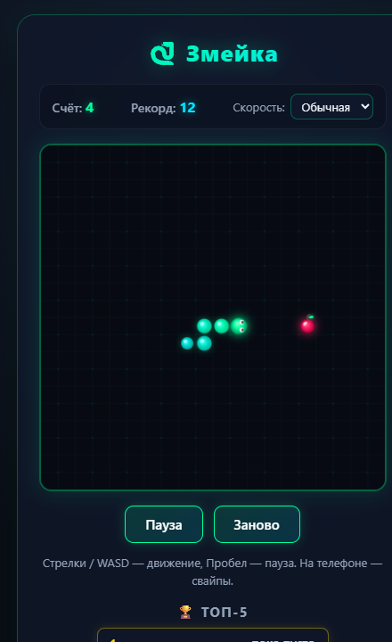
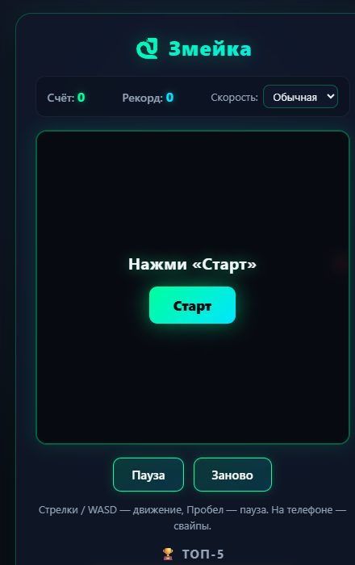

# 🐍 Snake Game (Tauri v2)

[](https://tauri.app/)
[](https://www.rust-lang.org/)
[](https://developer.mozilla.org/en-US/docs/Web/API/Canvas_API)
[](#windows-installer--portable)
[](#android-apk)
[](LICENSE)

<p align="center">
  
  &nbsp;&nbsp;
  
</p>

Классическая игра **«Змейка»**, реализованная на чистом **HTML5 Canvas** и портированная в нативное кроссплатформенное приложение для **Windows** и **Android** с помощью **Tauri v2** и **Rust**.

---

## 🎮 Особенности игры

- ⚡ **Легковесность и производительность**: нативное ядро на Rust обеспечивает мгновенный запуск и минимальное потребление оперативной памяти.
- 📱 **Кроссплатформенность**: единая кодовая база для десктопа (Windows 10/11) и мобильных устройств (Android).
- 🕹️ **Удобное управление**:
  - **ПК**: Стрелки или клавиши `W` / `A` / `S` / `D` для поворотов, `Пробел` — пауза/продолжить.
  - **Смартфоны**: управление свайпами по экрану в любую сторону.
- ⚙️ **Настройка сложности**: выбор скорости игры (Новичок, Обычная, Профи).
- 🏆 **Таблица рекордов**: сохранение лучшего счёта и локальный Топ-5 результатов.
- 🎨 **Кастомный дизайн и иконки**: уникальный набор векторных и растровых иконок под все плотности пикселей и системные темы (включая адаптивные иконки Android).

---

## 📦 Готовые дистрибутивы (Releases)

Свежие релизные сборки доступны на странице **[GitHub Releases v0.1.1 (Latest)](https://github.com/remageht/snake-game/releases/tag/v0.1.1)**:

| Платформа | Формат | Описание | Скачать с GitHub Releases |
| :--- | :--- | :--- | :--- |
| **Windows** | `.exe` (Setup) | **Рекомендуется**. Мастер установки NSIS (ярлыки, меню «Пуск») | [⬇️ Snake Game Setup (v0.1.1)](https://github.com/remageht/snake-game/releases/download/v0.1.1/Snake.Game_0.1.0_x64-setup.exe) |
| **Windows** | `.msi` | Официальный установщик Windows Installer | [⬇️ Snake Game MSI (v0.1.1)](https://github.com/remageht/snake-game/releases/download/v0.1.1/Snake.Game_0.1.0_x64_en-US.msi) |
| **Windows** | `.exe` (Portable) | Автономный портативный исполняемый файл без установки | [⬇️ Snake Game Portable (v0.1.1)](https://github.com/remageht/snake-game/releases/download/v0.1.1/snake-game.exe) |
| **Android** | `.apk` (Signed) | **Подписанный APK для установки на телефон (ARM64)** | [⬇️ Snake Game Android APK (v0.1.1)](https://github.com/remageht/snake-game/releases/download/v0.1.1/snake-game-signed.apk) |

> Локальные копии всех бинарных файлов также сохранены в каталоге [`release-artifacts/`](./release-artifacts/).

---

## 📂 Структура проекта

```text
snake-game/
├── dist/                          # Изолированный веб-бандл игры
│   ├── index.html                 # Разметка игрового поля и UI
│   ├── css/style.css              # Стили и адаптивная верстка
│   └── js/game.js                 # Игровая логика, свайпы и рекорды
├── src-tauri/                     # Rust бэкенд и конфигурация Tauri v2
│   ├── Cargo.toml                 # Манифест зависимостей Rust/Tauri
│   ├── build.rs                   # Хук сборки Tauri
│   ├── tauri.conf.json            # Параметры окна, метаданные и иконки
│   ├── capabilities/              # Политики безопасности Tauri v2
│   ├── icons/                     # Набор иконок всех разрешений
│   ├── src/
│   │   ├── lib.rs                 # Единая точка входа для десктопа и мобайла
│   │   └── main.rs                # Главный исполняемый файл десктопа
│   └── gen/android/               # Сгенерированный проект Android (Gradle + Kotlin)
├── release-artifacts/             # Готовые собранные пакеты (MSI, EXE, APK)
├── scripts/                       # Скрипты генерации иконок и утилиты
├── package.json                   # Скрипты CLI и зависимости Node.js
└── .gitignore                     # Правила исключения временных файлов и сборки
```

---

## 🛠️ Сборка из исходников

### Требования
1. **Node.js**: LTS (версия >= 20.x, проверено на v24.x)
2. **Rust**: stable toolchain (`rustc`, `cargo`)
3. **Для Windows**: C++ Build Tools (Visual Studio Community / Build Tools с Windows SDK)
4. **Для Android**:
   - Android SDK (API 34/35/36)
   - Android NDK (r27c или r28+)
   - JDK (Java 17 или Java 21/25 из Android Studio JBR)
   - Целевая платформа Rust: `rustup target add aarch64-linux-android`

### 1. Установка зависимостей
```bash
npm install
```

### 2. Запуск в режиме разработки (Desktop)
```bash
npm run tauri dev
```

### 3. Сборка пакетов под Windows (.msi / .exe)
```bash
npm run tauri build
```
Готовые инсталляторы будут созданы в папке:
`src-tauri/target/release/bundle/` (`msi/` и `nsis/`).

### 4. Сборка и подпись Android APK
```bash
npm run tauri android build -- --apk
```
Готовый установочный файл APK появится в папке:
`src-tauri/gen/android/app/build/outputs/apk/universal/release/app-universal-release-unsigned.apk`.

Для установки на устройство подпишите его с помощью `apksigner`:
```bash
apksigner sign --ks keystore.jks --ks-key-alias my-alias --out snake-game-signed.apk app-universal-release-unsigned.apk
```

---

## 📄 Лицензия

Проект распространяется под лицензией **MIT**. Подробности в файле [LICENSE](LICENSE).

Автор: **[@remageht](https://github.com/remageht)**
